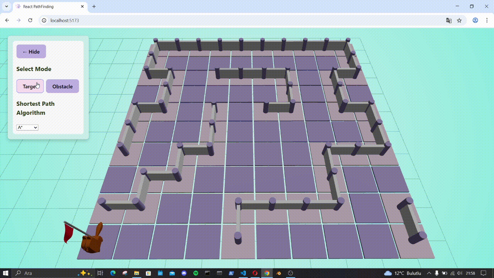

# 🐾 Yol Planlama Simülasyonu

Bu proje, React, Three.js ve Node.js kullanılarak geliştirilmiş interaktif bir **3D grid tabanlı yol bulma simülatörüdür**.  
Kullanıcı, harita üzerine engeller yerleştirip hedef tanımlar ve sevimli bir robot (animasyonlu kedi 🐱) A* veya Dijkstra algoritmasıyla hedefe ulaşmaya çalışır.

---

## 🤖 Bu Proje Hakkında

Bu uygulama, **React ve React Three Fiber** öğrenme sürecimin bir parçası olarak geliştirildi.  
Geliştirme boyunca denemeler yapmak, hataları çözmek ve sistemi adım adım iyileştirmek için  **ChatGPT desteği** de aldım tabii 😅

> Sadece bir simülasyon projesi değil — aslında gizli bir öğrenme oyun alanı 🚀

---

## 🚀 Özellikler

- 🧱 Etkileşimli hücrelere sahip grid tabanlı harita  
- 🧭 A* ve Dijkstra algoritmalarıyla yol planlama  
- 🐱 Yol boyunca hareket eden animasyonlu kedi ajan  
- 🧱 Sütun tipi engeller ve otomatik bağlanan köprüler  
- 🎨 Hover efekti ve sesli görselleştirme ile şekillendirilmiş hücreler  
- 🌿 Özel gradient arka plan ve dinamik ışıklandırma  
- ⚙️ Backend üzerinden temiz path hesaplama API’si

---

## 📸 Önizleme



---

## 🧠 Kullanılan Teknolojiler

- React + Three.js (`@react-three/fiber`, `drei`)  
- Node.js + Express  
- A* ve Dijkstra algoritmaları

---

## 📦 Kurulum ve Çalıştırma

```bash
# Client ve server bağımlılıklarını yükle
cd client && npm install
cd ../server && npm install

# Backend'i başlat
cd ../server && npm start

# Frontend'i başlat
cd ../client && npm run dev
```

# 🧩 Yapılacaklar / Çok Yakında
* Oyun modu: Seviye sistemi ve puanlama

* Algoritma görsel karşılaştırma araçları

* Kayıtlı harita düzenleyici

# 🤍 Geliştirici
: Sedanur Kırcı

Mekatronik mühendisi | Robotik yazılım geliştirici | Doğa ve kitap tutkunu


# 📄 Lisans
Bu projenin kaynak kodu MIT Lisansı ile lisanslanmıştır.
Ancak projede kullanılan bazı 3D modeller (kedi modeli ve bayrak) farklı lisanslara tabidir:

🐱 Kedi modeli: Free3D üzerinde Atıf ile Ücretsiz (Free with Attribution) lisanslıdır.

🏁 Bayrak modeli: Sketchfab üzerinden sağlanmış olup Creative Commons Atıf (CC-BY 4.0) lisansı altındadır.

Bu modeller için Kaynaklar bölümüne göz atabilirsiniz.

# 📁 Kaynaklar 

- 🐱 3D Kedi Modeli ve Animasyonları  
  Bu projede kullanılan kedi modeli, [Free3D](https://free3d.com/3d-model/cat-cartoon-rigged-520849.html) platformunda `supercg` tarafından sağlanmıştır.  

- 🏁 Hedef Bayrak Modeli  
    Bu projede kullanılan bayrak modeli, [Sketchfab](https://sketchfab.com/3d-models/low-poly-golf-flag-animated-a6ebddcfff9a4c8a912551530ebfdb45) üzerinde `inCook` tarafından paylaşılmıştır .
  
Proje yalnızca eğitimsel ve gösterim amaçlı kullanılmaktadır.